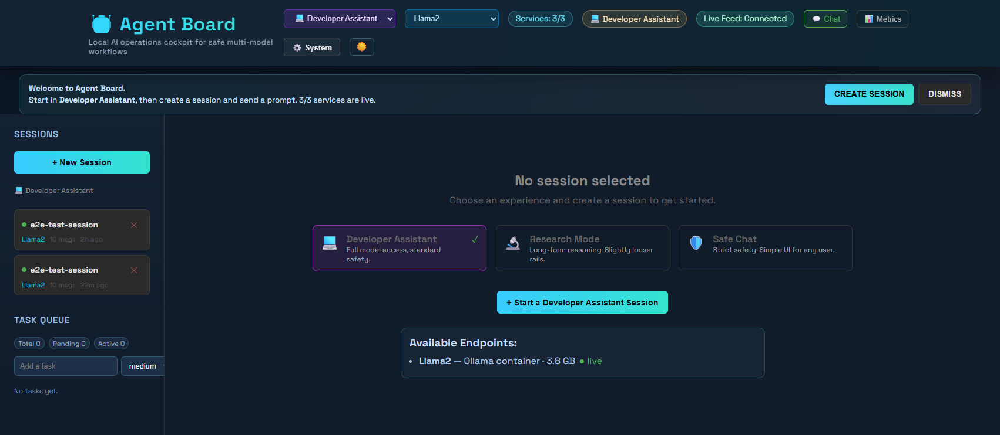
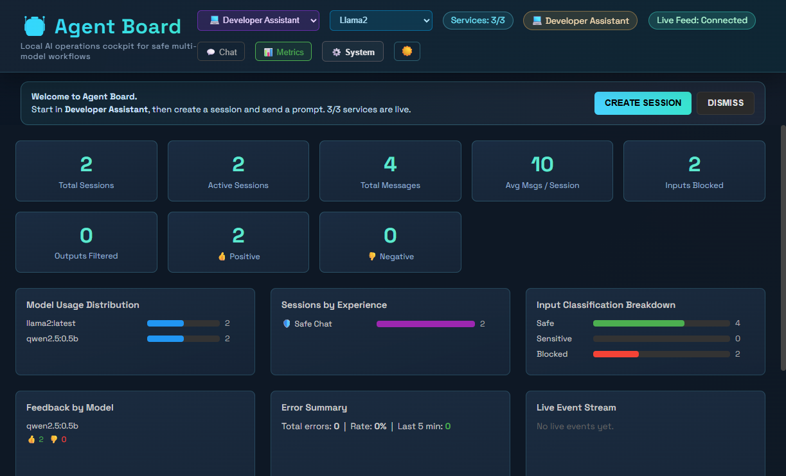
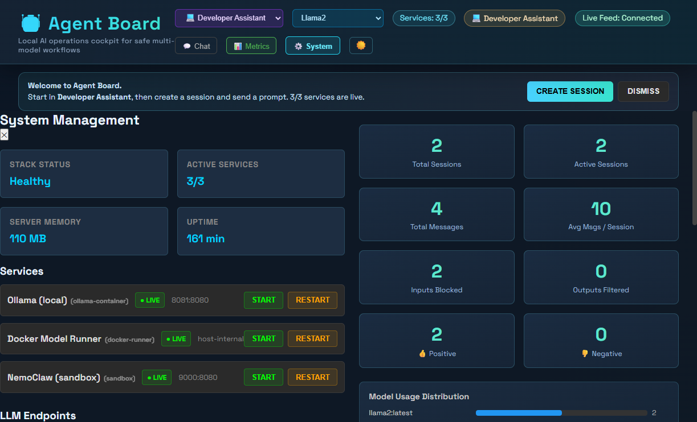

# Agent Board - Local AI Ops Cockpit

Agent Board is a local-first control room for multi-model AI workflows. It gives you a chat surface, safety rails, and live observability in one place, so you can run and evaluate model behavior without sending data to external APIs.

## Why Agent Board

- **Ship safer prompts faster**: built-in input classification, prompt-injection checks, blocked-input handling, and output sanitization.
- **Run multiple experiences**: switch between Developer Assistant, Research Mode, and Safe Chat with server-enforced routing and safety policies.
- **Observe everything live**: metrics dashboards, WebSocket event streaming, and OpenTelemetry traces to Jaeger.
- **Stay local-first**: designed to run on your own machine with Docker.

## Product Highlights

- **Experience-aware sessions**: persistent sessions with user context, role metadata, and full message history.
- **Safety layer**: PII detection/redaction, harmful content filtering, and strict-mode handling for sensitive workflows.
- **Model routing**: primary Ollama endpoint, Docker Model Runner endpoints, and server-side endpoint restrictions.
- **Operations UI**: dark and light themes, system panel controls, live container status, and endpoint health visibility.
- **Observability stack**: metrics APIs, event bus, persistence status, tracing status, and Jaeger integration.

## Screenshots

Captured from the local Docker stack at `http://localhost:3000`.

### Dashboard Overview



### Metrics View



### System Management



## Quick Start

```powershell
cd C:\Users\$env:USERNAME\code\agent-board
docker compose up -d
```

Enable Blackboard MCP only when needed:

```powershell
$env:BB_MCP_ENABLED='true'
docker compose --profile bb-mcp up -d
```

Open these endpoints:

- Dashboard: http://localhost:3000
- Jaeger UI: http://localhost:16686
- Ollama API: http://localhost:8081
- NemoClaw: http://localhost:9000

## What You Can Do In 2 Minutes

1. Open the dashboard and create a new session.
2. Pick an experience (Developer, Research, or Safe Chat).
3. Send a normal prompt, then a deliberately unsafe one to see safety interception.
4. Open the Metrics tab to inspect safety and feedback telemetry.
5. Check Jaeger to view request traces on the critical path.

## Features

- **Multi-model support**: Llama2, Qwen3-Coder (Ollama), Docker Model Runner, GLM-Flash
- **Agent sessions**: persistent session management with full message history
- **Safety sandbox**: NemoClaw integration for policy-enforced safe mode
- **Experience modes**: server-enforced endpoint and safety rules per experience
- **Metrics dashboard**: summary, safety, feedback, and error telemetry
- **Web dashboard**: React UI with live Docker status monitoring
- **OpenTelemetry tracing**: OTLP/HTTP export to Jaeger with graceful fallback
- **Instant model switching**: switch endpoints mid-conversation per session

## Directory Structure

```
dashboard/                    # Web UI & API server (React + Express)
  src/                        # React frontend
  tests/                      # Integration tests
  Dockerfile
config/                       # Configuration (future)
llm/                          # Model configs / Modelfiles (future)
services/                     # Additional microservices (future)
scripts/                      # Setup & management scripts
docker-compose.yml            # Stack definition
```


## Models & Selective Loading

Models are loaded at startup based on the `model-manifest.json` file in the repo root. Only models listed in the `enabled` array will be loaded. By default, only `llama2:latest` is enabled for minimal RAM usage.

To enable additional models:
1. Pull the model in your Ollama container (e.g. `docker exec ollama ollama pull qwen3-coder:latest`).
2. Add the model name to the `enabled` array in `model-manifest.json`.
3. Restart the stack.

**Example `model-manifest.json`:**
```json
{
  "default": "llama2:latest",
  "enabled": [
    "llama2:latest",
    "qwen3-coder:latest"
  ]
}
```

| Model | Size | Use |
|---|---|---|
| `llama2:latest` | 3.8 GB | Default — general chat, fits in RAM |
| `qwen3-coder:latest` | 18 GB | Code generation (requires ~18 GB free RAM) |
| `qwen3:latest` | 5.2 GB | General (MoE, loads as 17.7 GB at runtime) |

Pull additional models:
```powershell
docker exec ollama ollama pull llama3.2:latest   # 2 GB, good general model
docker exec ollama ollama pull qwen3:1.7b        # 1.4 GB, small but capable
```

### Docker Model Runner (optional)

Docker Desktop's built-in model runner is also wired up as an endpoint (`docker_runner`). To enable it:
1. Docker Desktop → Settings → Features in development → **Enable Docker Model Runner** + **Host-side TCP support**
2. Select "Docker Runner" in the dashboard sidebar

## API

### Sessions
- `POST /api/sessions` — Create session (`{ endpoint, model, name, userId, userRole, experience, safetyMode }`)
- `GET /api/sessions` — List all sessions
- `GET /api/sessions/:id` — Get session with messages
- `DELETE /api/sessions/:id` — Delete session
- `PUT /api/sessions/:id/model` — Switch model/endpoint (`{ endpoint, model }`)
- `POST /api/sessions/:id/feedback` — Record thumbs up/down on an assistant message (`{ messageIndex, positive }`)

### Messages
- `POST /api/sessions/:id/message` — Send message (`{ message, useSafeMode }`)

### Product Surface
- `GET /api/experiences` — List available experience configs
- `GET /api/metrics/summary` — Session/message totals, model distribution, experience distribution
- `GET /api/metrics/safety` — Input classifications, blocked prompts, filtered outputs
- `GET /api/metrics/feedback` — Positive/negative feedback by model and experience
- `GET /api/metrics/errors` — Error rate and recent failures

### System
- `GET /api/health` — Health check (LLM endpoints + Docker status)
- `GET /api/models` — Available models from all endpoints
- `GET /api/docker/status` — Container status
- `GET /api/system/services` — Service discovery catalog (resolved URLs, candidates, controllability)
- `POST /api/system/services/:serviceKey/:action` — Service action API (`start|stop|restart`, gated)
- `GET /api/persistence/status` — Postgres persistence status (configured/enabled)
- `GET /api/tracing/status` — OpenTelemetry tracing status (enabled/initialized/endpoint)

### Runtime Config
- `PRIMARY_LLM_URL` — Default primary Ollama URL fallback.
- `PRIMARY_LLM_URL_CANDIDATES` — Comma-separated discovery candidates for primary Ollama URL resolution.
- `AGENT_BOARD_ENABLE_DOCKER_CONTROL` — Set `true` to enable service action API endpoints.
- `DOCKER_COMPOSE_FILE` — Optional compose-file override for service actions.
- `DOCKER_PROJECT_DIR` — Optional compose project-directory override for service actions.

## Architecture

```
dashboard/
├── server.js         # Express API — session mgmt, LLM proxy, Docker status
├── src/
│   ├── App.jsx       # React frontend
│   ├── App.css       # Styles
│   └── main.jsx      # Entry point
├── tests/
│   ├── test-chat.js  # Integration test (session → message → delete)
│   └── e2e-chat.js
└── Dockerfile
```

## Management Scripts

```powershell
.\scripts\stack-manager.ps1 -Action start    # Start all containers
.\scripts\stack-manager.ps1 -Action stop     # Stop all
.\scripts\stack-manager.ps1 -Action restart  # Restart all
.\scripts\stack-manager.ps1 -Action status   # Show status
.\scripts\stack-manager.ps1 -Action logs     # Tail logs
```

## Troubleshooting

**Chat returns error / LLM not responding**
- Check Ollama has models: `docker exec llm_qwen_coder ollama list`
- Check memory — large models (qwen3-coder 18 GB) need enough free RAM
- Default model is `llama2:latest` which is safe for ~8 GB+ systems

**Container unhealthy**
- `docker logs agent-dashboard` — server errors
- `docker logs llm_qwen_coder` — Ollama errors (OOM will show here)

**Port conflicts**
- Ollama: `8081` (host) → `8080` (container)
- NemoClaw: `9000` → `8080`
- Dashboard: `3000` → `3000`


## GPU Acceleration (CUDA/RTX 4080)

To enable GPU acceleration for Ollama (recommended for RTX 4080 or similar):

1. **Install NVIDIA drivers** for your GPU (latest version recommended).
2. **Install NVIDIA Container Toolkit** on your host:
   - https://docs.nvidia.com/datacenter/cloud-native/container-toolkit/latest/install-guide.html
3. **Update Docker Compose** to use the NVIDIA runtime for the Ollama service:
   - Add to `ollama` service:
     ```yaml
     deploy:
       resources:
         reservations:
           devices:
             - driver: nvidia
               count: 1
               capabilities: [gpu]
     runtime: nvidia
     environment:
       - NVIDIA_VISIBLE_DEVICES=all
     ```
   - Or run with: `docker compose --gpus all up`
4. **Verify GPU is detected**:
   - `docker exec ollama nvidia-smi`
   - Ollama logs should show CUDA device available.
5. **Documented models**: After enabling GPU, add larger models to `model-manifest.json` as needed.

**Note:** If you have an RTX 4080, you should see ~24 GB VRAM available. Only enable large models if you have sufficient VRAM.

## Production Deployment

For production use:

- Use a dedicated secrets management solution (do not commit secrets to git).
- Set strong passwords for Postgres and any external services.
- Use Docker Compose overrides for production (e.g., `docker-compose.prod.yml`).
- Restrict exposed ports to trusted networks only.
- Enable HTTPS/SSL termination at the proxy or load balancer.
- Monitor resource usage and logs (Jaeger, dashboard, Ollama, bb-mcp).
- Regularly update images and dependencies.

**Example production override:**
```yaml
services:
  agent-dashboard:
    environment:
      - NODE_ENV=production
      - OTEL_ENABLED=true
      - OTEL_ENDPOINT=https://jaeger.prod.example.com:4318
    ports:
      - "127.0.0.1:3000:3000"  # Bind to localhost or internal network
```

## Safety & Security

- All traffic is local — no external API calls
- NemoClaw sandboxes agent execution with `--cap-drop=all`
- Capability allowlist: `NET_BIND_SERVICE` only
- `no-new-privileges` enforced on sandbox container
- Safe Chat sessions are server-restricted to the primary endpoint and strict safety mode
- Output filtering redacts detected PII and replaces blocked harmful responses before they reach the UI

## License

MIT
